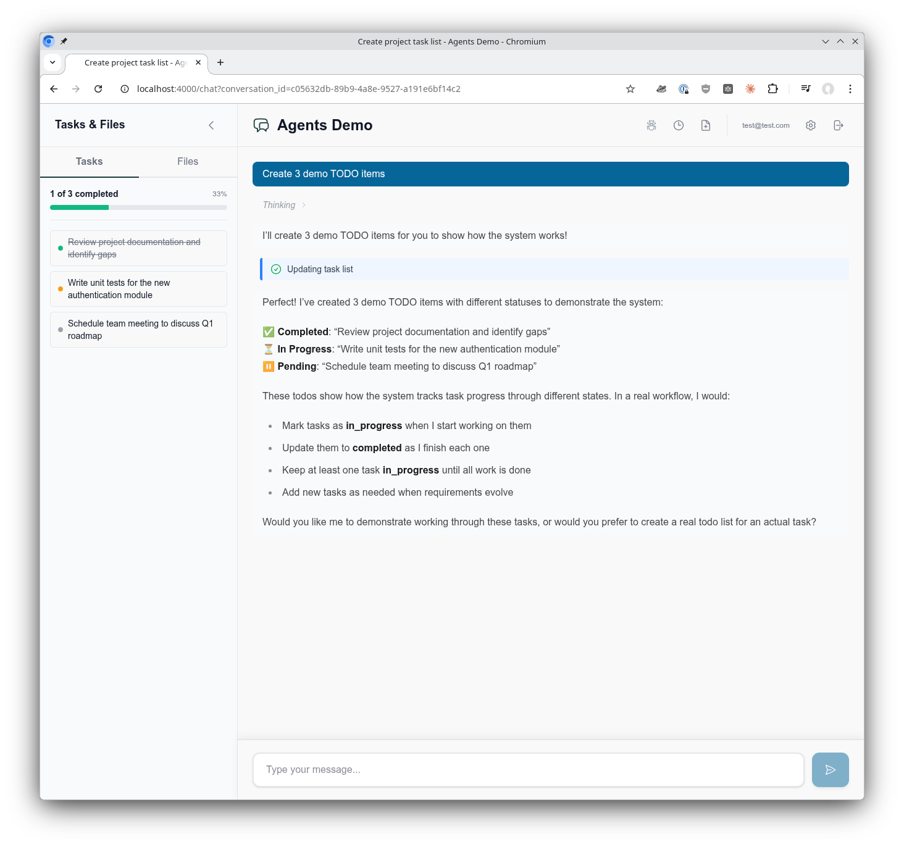
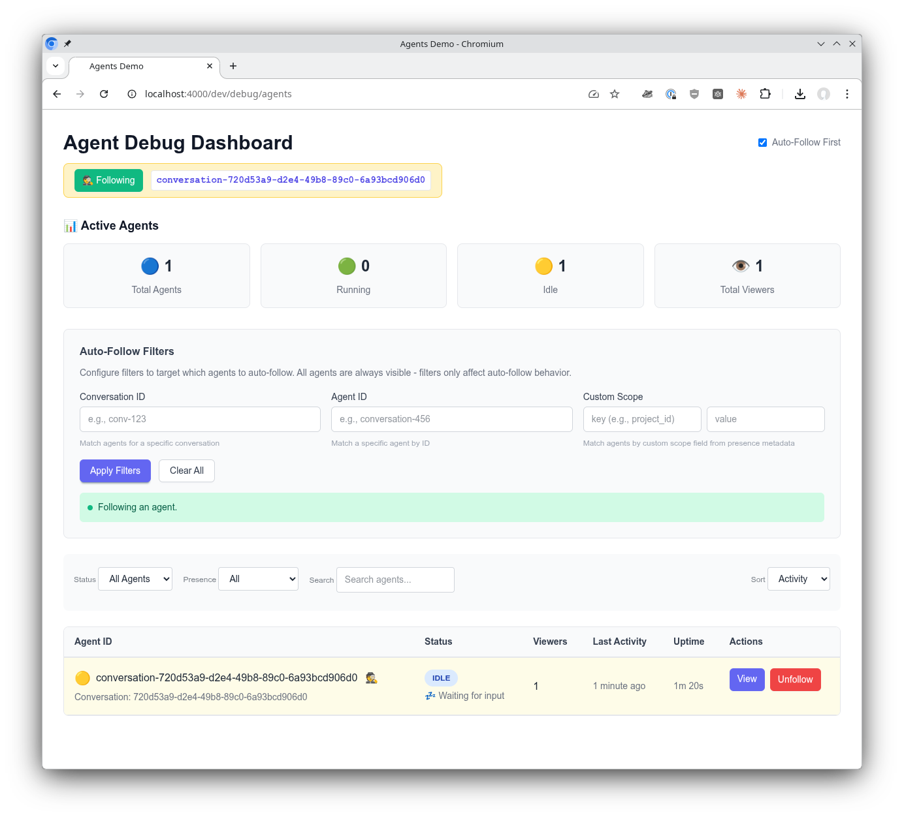
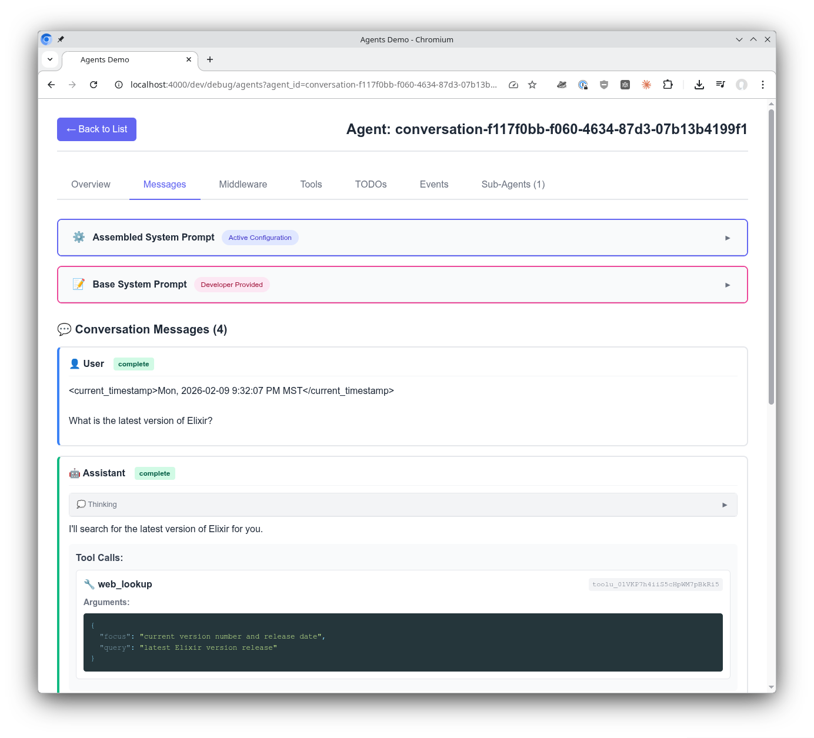
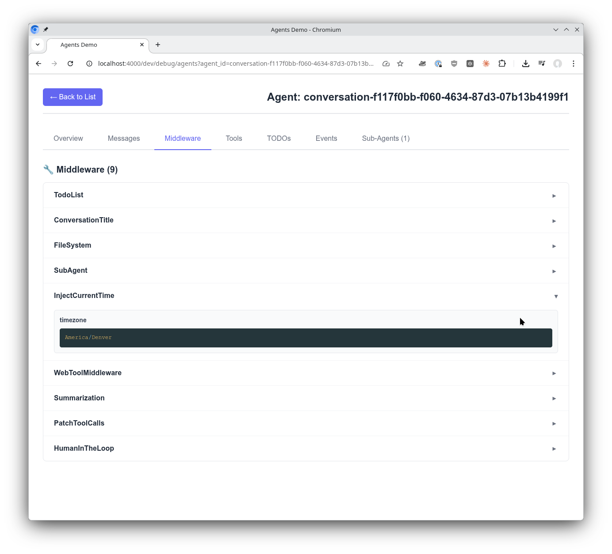
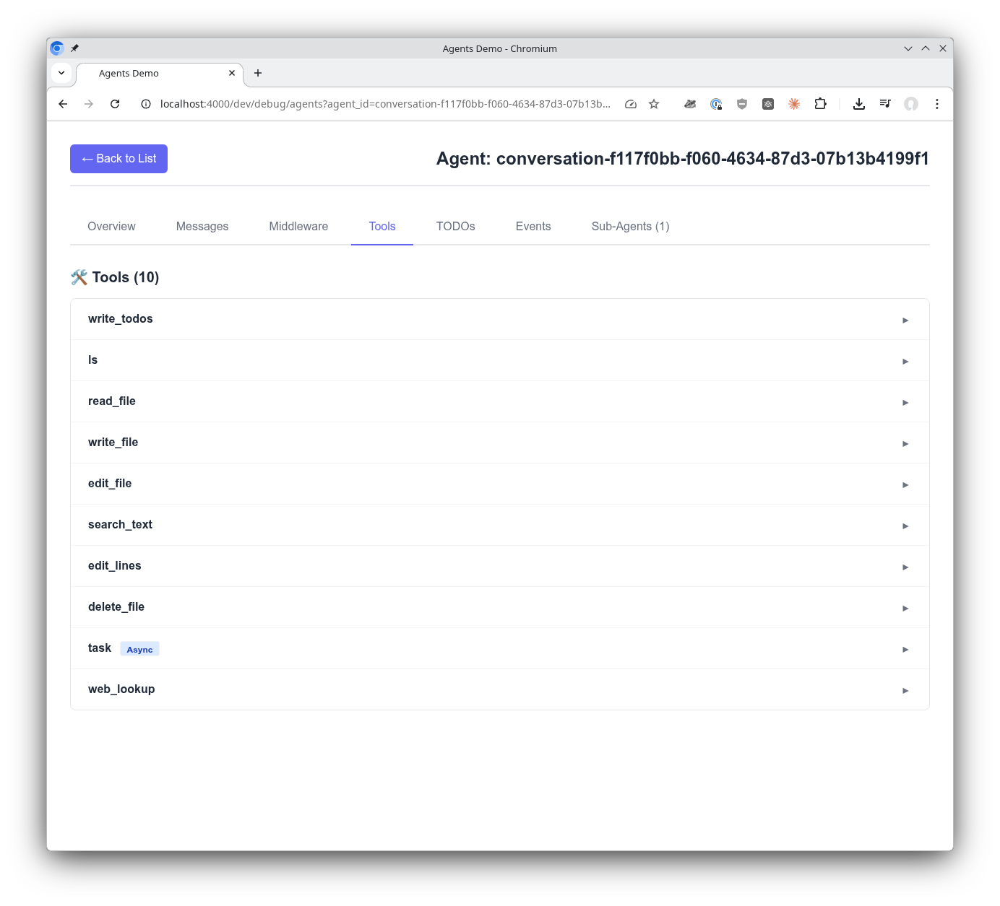
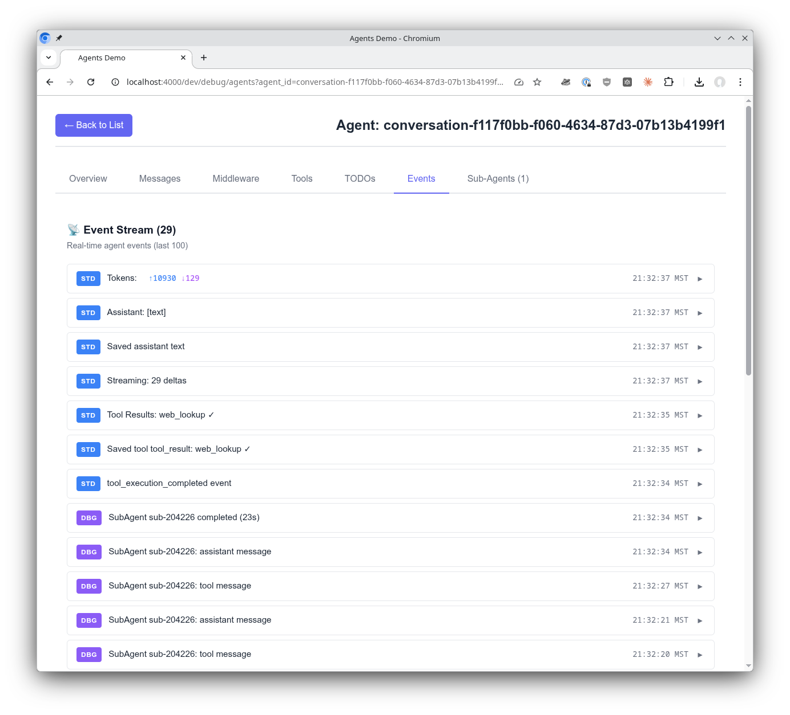
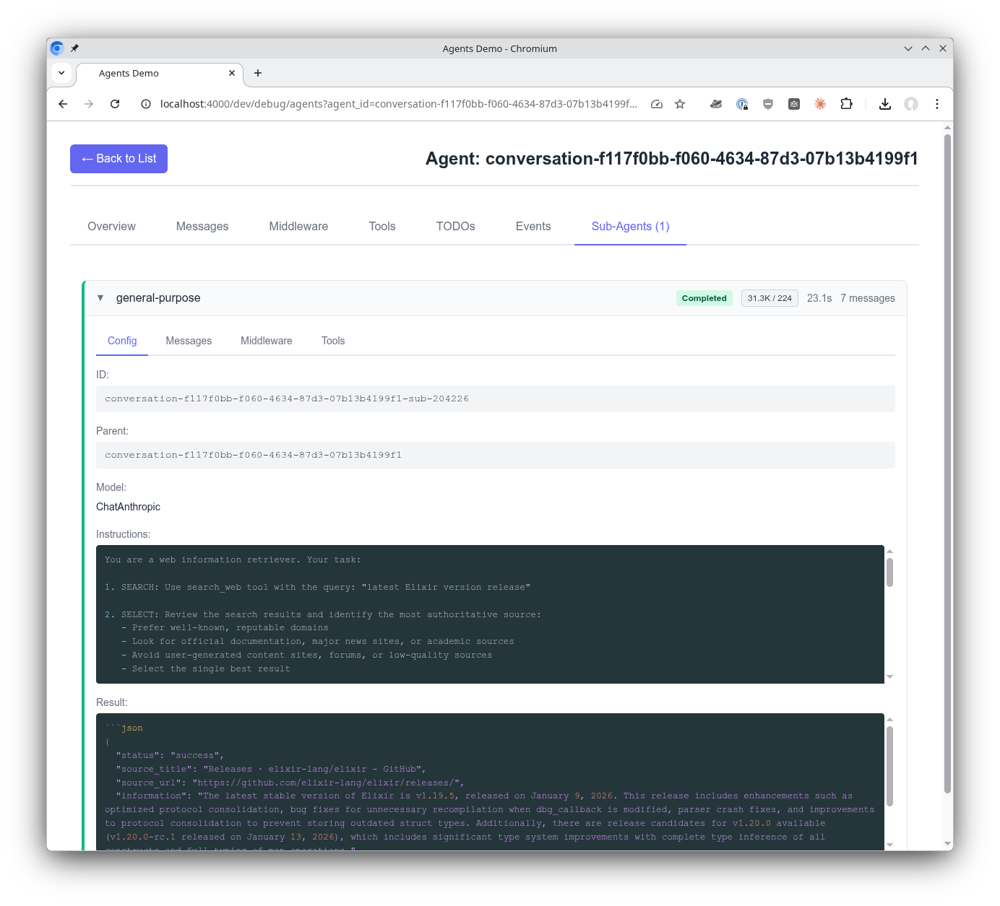
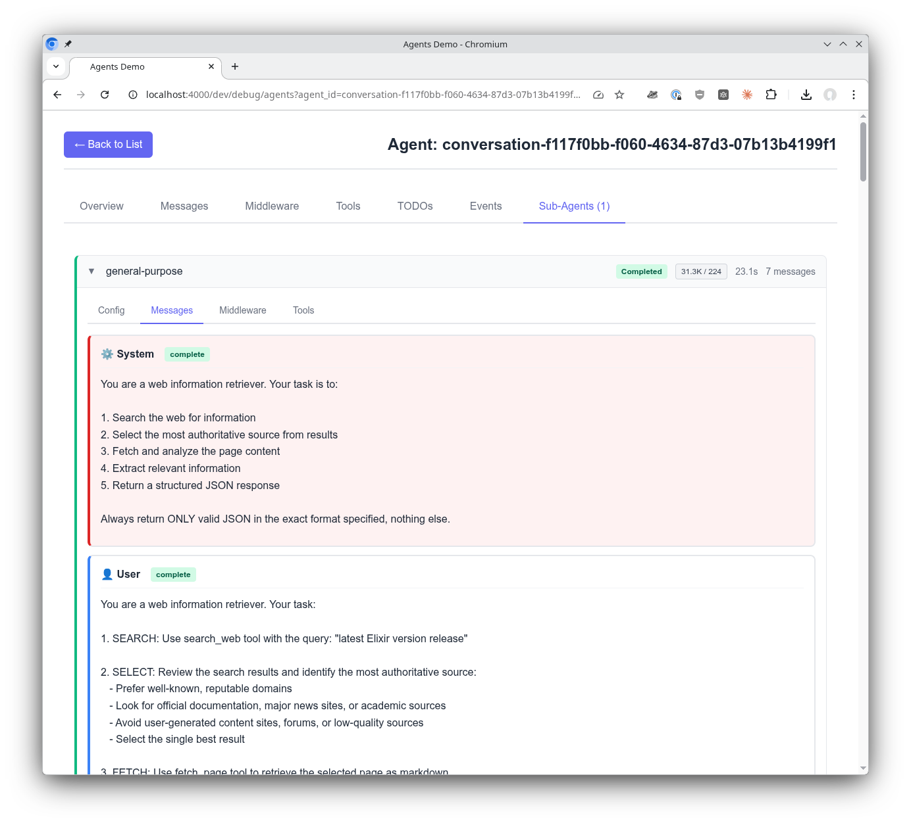
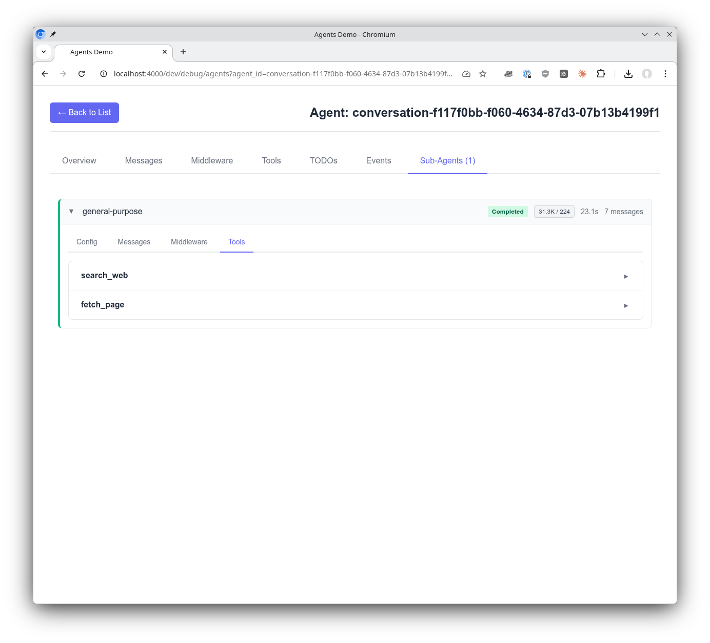

# Sagents Live Debugger

A Phoenix LiveView dashboard for debugging and monitoring [Sagents](https://github.com/sagents-ai/sagents) agents in real-time. Provides visibility into agent execution, message history, tool calls, middleware actions, todos, sub-agents, and event streams.

## Features

- **Real-time Agent Monitoring**: View all running agents with status, uptime, and viewer counts
- **Presence-Based Discovery**: Agents are discovered instantly via Phoenix Presence (no polling)
- **Auto-Follow First**: Automatically follow the first matching agent that appears for immediate debugging
- **Sub-Agent Visibility**: Monitor sub-agents spawned by parent agents with full event tracking
- **Message Inspection**: Browse complete message history with tool calls, results, and thinking blocks
- **Event Stream**: Live feed of agent events (LLM calls, middleware actions, tool executions)
- **Todo Tracking**: Monitor agent task lists and progress in real-time
- **Production Safe**: Filter-based agent selection for production environments

## Installation

Add `sagents_live_debugger` to your list of dependencies in `mix.exs`:

```elixir
def deps do
  [
    {:sagents_live_debugger, "~> 0.1.0"}
  ]
end
```

## Screenshots


## Setup

Add the debugger to your Phoenix router:

```elixir
# lib/my_app_web/router.ex
import SagentsLiveDebugger.Router

scope "/dev" do
  pipe_through :browser

  sagents_live_debugger "/debug/agents",
    coordinator: MyApp.Agents.Coordinator
end
```

**Important:** Ensure your application has configured the timezone database in `config/config.exs`:

```elixir
# config/config.exs
import Config

# Required for timezone support
config :elixir, :time_zone_database, Tzdata.TimeZoneDatabase
```

That's it! Visit `http://localhost:4000/dev/debug/agents` to access the debugger.

Try it out yourself in the [AgentsDemo](https://github.com/sagents-ai/agents_demo) project. It's built-in and ready to explore!



## Configuration Options

The `sagents_live_debugger` macro accepts the following options:

### Required

- `:coordinator` - Your application's agent coordinator module (created through a mix task)

### Optional

- `:presence_module` - Phoenix Presence module for real-time agent discovery and viewer tracking

### Example with All Options

```elixir
sagents_live_debugger "/debug/agents",
  coordinator: MyApp.Agents.Coordinator,
  presence_module: MyApp.Presence
```

## Key Features

### Presence-Based Agent Discovery

The debugger discovers agents in real-time using Phoenix Presence. When an agent starts with `presence_module` configured, it immediately appears in the debugger's agent list - no polling required.

Configure your AgentServer with presence:

```elixir
AgentServer.start_link(
  agent: agent,
  pubsub: {Phoenix.PubSub, :my_pubsub},
  presence_module: MyApp.Presence
)
```

Agent presence metadata includes:
- `status` - Current agent status (:idle, :running, :interrupted, etc.)
- `started_at` - When the agent started (for uptime display)
- `last_activity_at` - Last activity timestamp
- `conversation_id` - Associated conversation (if any)
- Custom scope fields from `filesystem_scope` (e.g., `project_id`, `user_id`)



### Auto-Follow First

In development mode, the debugger automatically follows the first agent that appears. This eliminates the need for manual agent selection during local development.

Toggle auto-follow using the checkbox in the header, or configure the default in your application's config:

```elixir
# To disable auto-follow by default (e.g., in production)
config :sagents_live_debugger,
  auto_follow_default: false
```

**Note:** The library defaults to dev-friendly settings (auto-follow on). You only need to add config to change this default.

### Agent Messages

Get insights into the message exchange from the perspective of the agent. Middleware is used to build the system prompt for your agent. See exactly how the agent is configured quickly and easily. Browse the complete message history including tool calls, tool results, and thinking blocks.



### Middleware Config

A significant feature of Sagents is how middleware makes an agent's abilities composable and powerful. See the middleware your agent was configured with and explore the configured settings for each middleware.



### Tool Insights

Tools are the way agents get things done. See all the tools, their configuration, and instructions to the agent revealed in one easy location.



### Event Stream

When working with agents, being able to see the stream of events they are receiving and emitting is incredibly valuable. The SagentsLiveDebugger subscribes to the additional and optional debug event stream to give even greater insights into what's happening with your agent.



### Sub-Agents Tab

When an agent spawns sub-agents (via the Task tool), they appear in the Sub-Agents tab with full visibility:

- **Lifecycle Events**: Started, status changes, completion, errors
- **Real-time Streaming**: See LLM responses as they stream
- **Configuration View**: Instructions, tools, middleware, model
- **Messages View**: Complete conversation history
- **Duration Tracking**: Execution time for each sub-agent

Sub-agent events are automatically broadcast through the parent agent's debug topic, requiring no additional configuration.

Getting insight into sub-agents is critically important. Sub-agents are launched by the main agent when it determines they are needed. They receive their instructions from the main agent and return their response back to the main agent. This visibility into sub-agents helps you confirm the system is working as expected, or reveals issues where something isn't configured correctly.

#### Sub-Agent Config

See what instructions a sub-agent received from the main agent and what its response was. This reveals the full picture of the delegation: what was asked and what was returned.



#### Sub-Agent Messages

View the multi-turn conversation a sub-agent has as it uses tools and works towards an answer for its task. Follow the sub-agent's reasoning step by step.



#### Sub-Agent Tools

See the tools a sub-agent has access to in order to do its work.



## Architecture Notes

### Plugin Design

The debugger is designed as a self-contained plugin library:
- No JavaScript files to compile or bundle
- All CSS is inlined in the layout
- All JavaScript is inlined for timezone detection
- Zero configuration beyond adding to router

### Event-Driven Architecture

The debugger is entirely event-driven (no polling):

- **Agent List**: Built from presence metadata, updates via `presence_diff` events
- **Agent Detail**: Real-time updates via PubSub subscriptions
  - `status_changed` - Status updates
  - `todos_updated` - Todo list changes
  - `llm_message` - New messages
  - `{:subagent, id, event}` - Sub-agent events
- **Sub-Agents**: Events broadcast through parent agent's debug topic

### Debug Event Flow

```
AgentServer                    Debugger (LiveView)
    |                               |
    |-- presence track ------------>|  Agent appears in list
    |                               |
    |-- {:debug, event} ----------->|  Debug events stream
    |                               |
    |                               |
SubAgentServer                      |
    |                               |
    |-- via parent.publish_debug -->|  Sub-agent events
    |                               |
```

## Browser Compatibility

Automatic timezone detection for the event display uses `Intl.DateTimeFormat().resolvedOptions().timeZone`, which is supported in:
- Chrome/Edge 24+
- Firefox 52+
- Safari 10+

Older browsers will gracefully fall back to displaying timestamps in UTC.

## Environment Configuration

The debugger uses dev-friendly defaults out of the box. For production deployments, add configuration to your application's config files:

| Setting | Default | Description |
|---------|---------|-------------|
| `auto_follow_default` | `true` | Auto-follow first agent that appears |

**Example production configuration:**

```elixir
# config/prod.exs in YOUR application (not the library)
config :sagents_live_debugger,
  auto_follow_default: false
```

With production settings, users must manually select agents to follow.

## License

Apache-2.0 license - see [LICENSE](LICENSE) for details.

